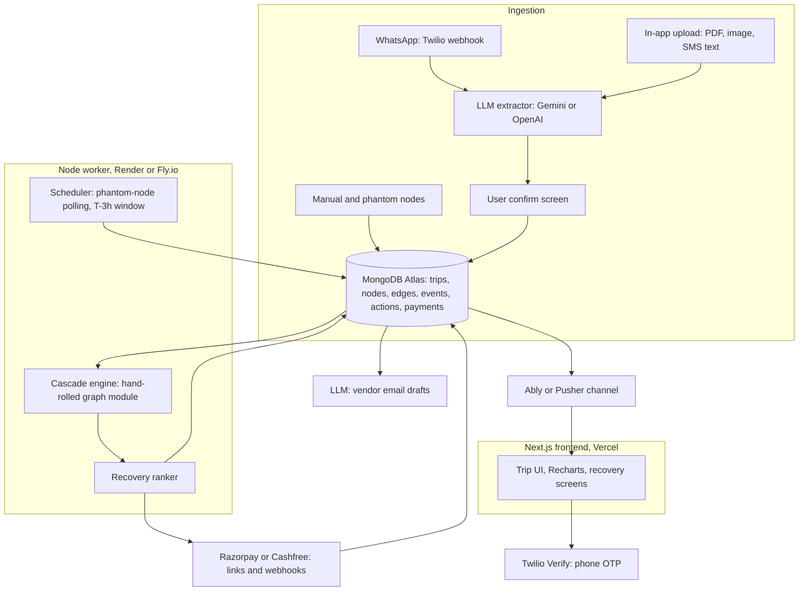

# YatraSarthi: full build guide

Stack, data model, module skeletons, and a phased plan — updated for MongoDB Atlas, a hand-rolled graph module, and a pluggable Gemini/OpenAI LLM layer. Build with Google Antigravity or Claude Code; no Claude API in the running app.

## 1. Final stack

| Layer | Choice | Why |
| --- | --- | --- |
| Language | TypeScript, full stack | One language across frontend, backend and worker — fewer tools to learn alongside a new DB and a new domain. |
| Frontend | Next.js (App Router), Recharts | Unchanged from the original plan. |
| API | Next.js route handlers, in the same app | Most endpoints (trip CRUD, ingestion, recovery, payments webhooks) don't need a separate service. |
| Background worker | Small standalone Node/TS service | Handles what serverless functions do badly: the phantom-node polling scheduler and anything long-running. |
| Database | **MongoDB Atlas** (replaces SQLite) | You already know it. Trip state is naturally a document, so this is a closer fit than SQLite ever was — see Section 3. |
| Graph engine | **Hand-rolled TS module** (replaces networkx) | Trip graphs are a few dozen nodes at most. See Section 2. |
| LLM (extraction, drafting) | **Pluggable: Gemini (Google AI Studio) default, OpenAI as swap-in** | No Claude API in the running app. See Section 4. |
| WhatsApp ingestion | Twilio WhatsApp Sandbox → Business Platform later | As agreed earlier. |
| Auth | Twilio Verify (phone OTP) | Reuses the Twilio account you already need for WhatsApp — no separate auth provider. |
| Payments | Razorpay or Cashfree (test mode for the demo) | Split-pay links plus webhooks, as agreed earlier. |
| Realtime | Ably or Pusher (managed channels) | A raw WebSocket server is one more thing to host and scale. A managed channel does the same job for the demo with a five-minute setup. |
| Hosting | Vercel (web), Render or Fly.io (worker), MongoDB Atlas (managed) | All have workable free tiers. |

If you'd rather stay in Python: FastAPI + Motor (the async MongoDB driver) + the same hand-rolled graph logic map onto everything below one-for-one. The rest of this guide assumes the TypeScript stack above.

### Architecture



### Repo layout

```
yatrasarthi/
  apps/
    web/          # Next.js app: UI + most API routes
    worker/       # Node/TS service: scheduler, cascade engine, realtime publisher
  packages/
    graph/        # TripGraph module (Section 2), shared by web + worker
    llm/          # ExtractorProvider interface + Gemini/OpenAI adapters (Section 4)
    types/        # Shared TS types: Trip, Node, Edge, Action, Event
  infra/
    .env.example
```

pnpm workspaces is enough to wire the packages together — no need for a heavier monorepo tool at this size.

## 2. Graph engine — replacing networkx

| Option | Verdict |
| --- | --- |
| **Hand-rolled module (recommended)** | \~150 lines. A trip graph is a few dozen nodes — a dependency buys you nothing, and the slack-propagation logic in Section 6 of the solution doc isn't something any library ships anyway. |
| `graphology` (npm) | Fine if you want ready-made topological-sort and cycle-detection helpers instead of writing your own. |
| `graphlib` (npm) | Smaller and older than graphology; also has topological sort built in. |

Skeleton (`packages/graph/src/tripGraph.ts`):

```
type Constraint = "hard" | "soft";
interface GraphEdge { from: string; to: string; bufferMin: number; paddingMin: number; constraint: Constraint; }

export class TripGraph {
  nodes = new Set<string>();
  edges: GraphEdge[] = [];
  addNode(id: string) { this.nodes.add(id); }
  addEdge(e: GraphEdge) { this.edges.push(e); }

  private preds(id: string) { return this.edges.filter(e => e.to === id); }

  topoOrder(): string[] {           // Kahn's algorithm — plain, no library needed
    const indeg = new Map([...this.nodes].map(n => [n, 0]));
    this.edges.forEach(e => indeg.set(e.to, (indeg.get(e.to) ?? 0) + 1));
    const queue = [...this.nodes].filter(n => indeg.get(n) === 0);
    const order: string[] = [];
    while (queue.length) {
      const n = queue.shift()!;
      order.push(n);
      this.edges.filter(e => e.from === n).forEach(e => {
        indeg.set(e.to, indeg.get(e.to)! - 1);
        if (indeg.get(e.to) === 0) queue.push(e.to);
      });
    }
    return order;
  }

  propagateDelay(brokenNode: string, delayMin: number) {
    const delay = new Map<string, number>([[brokenNode, delayMin]]);
    const broken: string[] = [], atRisk: string[] = [];
    for (const n of this.topoOrder()) {
      const incoming = this.preds(n).map(e => {
        const upstream = delay.get(e.from) ?? 0;
        const slack = e.bufferMin + e.paddingMin;
        return { remaining: Math.max(0, upstream - slack), constraint: e.constraint };
      });
      const worst = incoming.reduce((a, b) => (b.remaining > a.remaining ? b : a), { remaining: 0, constraint: "soft" as Constraint });
      if (worst.remaining > 0) {
        delay.set(n, worst.remaining);
        (worst.constraint === "hard" ? broken : atRisk).push(n);
      }
    }
    return { broken, atRisk, delay };
  }
}
```

That single `propagateDelay` pass is the whole cascade engine from Section 6 of the solution doc. The worker calls it whenever a node's status changes.

## 3. Data model — MongoDB Atlas, replacing SQLite

The original design already treated trip state as "a JSON blob" — a document database is a closer fit than SQLite ever was, not a downgrade. An M0 free cluster is enough for the whole build.

| Collection | Holds | Key fields |
| --- | --- | --- |
| `trips` | One doc per trip | `name, destination, dates, memberIds[], joinCode, healthScore, status` |
| `nodes` | Every booking or phantom leg | `tripId, type, vendor, time, constraintType, status, rawExtract, confidence` |
| `edges` | Buffers between nodes | `tripId, fromNodeId, toNodeId, bufferMin, paddingMin, constraint` |
| `events` | Append-only log (Section 14 of the solution doc) | `tripId, seq, actor, type, payload, ts` |
| `actions` | Recovery-plan steps and their state | `tripId, state, confirmType: "self-reported" \| "vendor-verified", proofRef` |
| `payments` | Per-member split-pay entries | `tripId, actionId, memberId, amount, status, aggregatorRef` |
| `users` | Accounts | `phone, name, whatsappOptIn` |

Sample `nodes` document:

```
{
  _id: ObjectId(),
  tripId: ObjectId("..."),
  type: "train",
  vendor: "IRCTC",
  time: ISODate("2026-11-14T16:00:00+05:30"),
  constraintType: "soft",
  status: "at_risk",
  rawExtract: { pnr: "8214...", from: "Pune", to: "Goa" },
  confidence: { pnr: 0.97, time: 0.99 }
}
```

Indexes worth adding from day one: `{ tripId: 1 }` on every collection, and `{ tripId: 1, seq: 1 }` on `events` for fast replay.

## 4. LLM layer — Gemini default, OpenAI swap-in

One interface, two adapters, chosen by an env var — nothing else in the app touches the provider directly.

```
// packages/llm/src/types.ts
export interface ExtractedBooking { type: string; fields: Record<string, unknown>; confidence: Record<string, number>; }
export interface ExtractorProvider {
  extractBooking(input: { text?: string; imageBase64?: string; mimeType?: string }): Promise<ExtractedBooking>;
  draftVendorEmail(ctx: { booking: unknown; policy: string; requestedChange: string }): Promise<{ subject: string; body: string }>;
}
```

| Provider | SDK | Notes |
| --- | --- | --- |
| Gemini (Google AI Studio), default | `@google/genai` | Use a current Flash-tier model — check ai.google.dev for the latest stable ID, this moves fast. Multimodal (PDF/image) input and a JSON response schema cover the whole extraction step in one call. |
| OpenAI, alternative | `openai` | Use Structured Outputs with a JSON schema and vision input the same way. Swap by changing `LLM_PROVIDER` — no other code changes. |

Both adapters return the same `ExtractedBooking` shape, so the confirm screen (Section 12 of the solution doc) and the low-confidence-field flagging work identically regardless of which one is active.

## 5. Ingestion wiring

### WhatsApp (Twilio)

1. Twilio webhook posts to `apps/web/app/api/whatsapp/webhook/route.ts` on every inbound message.
2. Look up the sender's phone against `users`; if the message body is a join code, bind that number to the matching `tripId` and stop.
3. Otherwise, download any media URL Twilio provides, pass text or media into `ExtractorProvider.extractBooking`, and push the result to the user's confirm screen via the realtime channel.

### In-app upload

1. Client uploads to a signed URL or directly to the API route as multipart form data.
2. Same `extractBooking` call, same confirm screen — this path and WhatsApp converge immediately after step 1.

## 6. Core API routes

| Method | Path | Purpose |
| --- | --- | --- |
| POST | /api/trips | Create a trip |
| POST | /api/trips/:id/join | Join via code |
| POST | /api/ingest/upload | In-app document upload |
| POST | /api/whatsapp/webhook | Twilio inbound webhook |
| POST | /api/nodes/:id/confirm | User confirms an extracted booking |
| POST | /api/nodes/phantom | Add a manual leg |
| GET | /api/trips/:id/graph | Current nodes, edges, statuses |
| POST | /api/disruptions/report | "Running late" or a detected delay, triggers cascade |
| GET | /api/trips/:id/recovery-options | Ranked options for the active disruption |
| POST | /api/actions/:id/propose | Group proposes an option |
| POST | /api/actions/:id/confirm | Self-confirm or upload vendor proof |
| POST | /api/payments/create-links | Create one aggregator link per payer |
| POST | /api/payments/webhook | Aggregator payment-status webhook |
| POST | /api/suraksha/trigger | SOS payload out to emergency contacts |

## 7. Realtime updates

- Every write to `trips`, `nodes`, or `actions` also publishes a small event to an Ably (or Pusher) channel scoped to that trip.
- The frontend subscribes to the trip's channel on load; on any event it refetches just the changed piece, not the whole graph.
- Kept out of the serverless web app on purpose — the worker service owns the scheduler and can publish from the same place it runs the cascade, so status changes and their broadcast happen in one process.

## 8. Payments

1. Group agrees an option (Section 7 of the solution doc) → `/api/payments/create-links` creates one Razorpay/Cashfree payment link per payer, each tagged with `actionId` and `memberId`.
2. Aggregator webhook lands on `/api/payments/webhook`, signature-verified, flips that payer's status to `paid`.
3. Once every payer for an action is `paid`, the action moves to `executing`.
4. Use the aggregator's test mode for all development and the demo — no real money moves until you deliberately switch keys.

## 9. Auth

Twilio Verify: request an OTP to the phone number, verify the code, issue your own session token (a signed JWT in an HTTP-only cookie is enough). No separate identity provider needed since you're already paying for Twilio for WhatsApp.

## 10. Build phases

| Phase | Build | Hand to the agent as |
| --- | --- | --- |
| **1 — Skeleton** | Repo scaffold, Mongo Atlas connection, auth, trip CRUD, join flow | One task: "scaffold the repo per Section 1's layout, wire Mongo Atlas and Twilio Verify auth" |
| **2 — Ingestion** | Upload route, WhatsApp webhook, both `ExtractorProvider` adapters, confirm screen | Two parallel tasks (one per channel) if using Antigravity's Manager view; sequential if using Claude Code alone |
| **3 — Graph & health** | `TripGraph` module, node/edge CRUD, health score, timeline UI | One task, since the graph module and its UI are tightly coupled |
| **4 — Disruption & recovery** | Cascade trigger, mock flight/train/road providers, recovery ranker, option UI | Build the mock providers first and pin the demo script to them before touching real ones |
| **5 — Payments & execution** | Split-pay links, webhooks, action state machine, self-confirm and proof-upload UI | One task; this is the highest-risk phase for bugs, test it in isolation before wiring to recovery |
| **6 — Suraksha & polish** | SOS flow, realtime wiring, group decision screen, demo rehearsal | Last, once everything else is stable |

Antigravity's Manager view is built for running Phases 2 onward as parallel agents per module, with its task-list and walkthrough Artifacts as your review checkpoint before merging each one. Claude Code works just as well one task at a time from the terminal — pick whichever fits how you like to review code, and feel free to mix: e.g. Claude Code for Phase 3 and 5, where determinism matters most, Antigravity for scaffolding the UI-heavy phases in parallel.

## 11. Environment variables

```
MONGODB_URI=
JWT_SECRET=
LLM_PROVIDER=gemini            # or openai
GOOGLE_AI_STUDIO_API_KEY=
OPENAI_API_KEY=
TWILIO_ACCOUNT_SID=
TWILIO_AUTH_TOKEN=
TWILIO_WHATSAPP_NUMBER=
TWILIO_VERIFY_SERVICE_SID=
RAZORPAY_KEY_ID=
RAZORPAY_KEY_SECRET=
ABLY_API_KEY=
```

## 12. Demo rehearsal checklist

- Every demo phone has sent the Twilio WhatsApp Sandbox join code that same day.
- Flight/train/road providers are on the mock adapter, scripted to Rahul's 4-hour delay.
- Payment aggregator is in test mode with test UPI IDs ready for both payers.
- Walk the full path once before presenting: ingest via WhatsApp, ingest via upload, trigger the delay, see the cascade, pick a recovery option, pay, self-confirm, watch it go green.

## 13. Alternatives, quick reference

| You asked about | Replaced with | Why this one |
| --- | --- | --- |
| networkx | Hand-rolled `TripGraph` module (Section 2) | The graphs are tiny; a library buys nothing and the slack-propagation logic has to be custom either way. |
| SQLite | MongoDB Atlas (Section 3) | You already know it, and the original design's "JSON blob" state is exactly what a document store is for. |

## 14. Open risks

- Twilio WhatsApp Sandbox rate limits and the join-code requirement are fine for a demo but not for real users — the Business Platform migration from the solution doc still applies before any public launch.
- Gemini and OpenAI both ship new model versions often; pin a model ID in Phase 1 and treat upgrading it as a deliberate, tested change, not an automatic one.
- Ably/Pusher free tiers cap concurrent connections — fine through the build and demo, worth checking before a public launch.