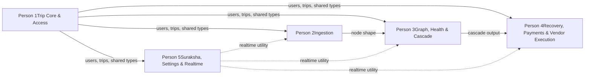

# YatraSarthi: 5-person work split

Split by feature, not by frontend/backend — with agentic tools, each person can direct an agent across the whole stack for their slice, so a layer-based split would just add handoffs nobody needs. Every slice includes wiring the already-built UI to a real API contract, since that's the piece still outstanding everywhere.

## 1. How this works

- Each person owns one **vertical**: its data, its API routes, its business logic, and refining the existing UI screens for that feature to actually call that API.
- "Refine the UI" is not a separate sixth task — it's the last step inside each person's own slice, done once their API is real: replace placeholder data, add the loading/empty/error states the UI plan specifies, and hook up realtime updates.
- The five slices aren't equally sized in screen count, because they aren't equally sized in logic. Recovery and payments is the densest — it's also the app's actual value proposition, so it's worth one dedicated owner rather than splitting it.

### Dependency map

Person 1 blocks everyone lightly (they need the trip/user shape and the shared types package to exist, not the full feature). Person 5's realtime utility is the other early dependency — everyone calls it to broadcast status changes.

## 2. Person 1 — Trip Core & Access

### Owns (UI screens)

A1–A4 (splash, onboarding, phone sign-in, permissions), B1–B4 (trips list, create trip, invite/Kutumb link, trip settings)

### Backend / data

`users` and `trips` collections; Twilio Verify OTP flow; authors `packages/types` — the shared TS types (Trip, Node, Edge, Action, Event, User) everyone else imports.

### API routes

`POST /api/trips`, `POST /api/trips/:id/join`

### UI-refinement task

The auth screens, trips list, create-trip form, invite screen and trip settings already exist. Wire each to the real routes above, replace any placeholder trip data on B1, and implement the "needs attention" status banner once a trip's real status field exists (it will just read `unhealthy` until Person 3 starts writing real values to it).

### Note

This slice should start first — everyone else needs the `trips`/`users` shape and the shared types package before their own work compiles cleanly.

## 3. Person 2 — Ingestion

### Owns (UI screens)

C1–C6 (ingestion hub, WhatsApp setup, upload document, extraction review & confirm, add phantom node, booking detail)

### Backend / data

`nodes` collection; authors `packages/llm` — the `ExtractorProvider` interface plus the Gemini and OpenAI adapters; the Twilio WhatsApp webhook handler.

### API routes

`POST /api/ingest/upload`, `POST /api/whatsapp/webhook`, `POST /api/nodes/:id/confirm`, `POST /api/nodes/phantom`

### UI-refinement task

C1–C6 exist already. Wire the upload and WhatsApp-setup screens to the real routes, and make the extraction review screen (C4) actually render the per-field confidence flags coming back from `ExtractorProvider` instead of static placeholders — that flagging is the whole point of that screen.

## 4. Person 3 — Graph, Health & Cascade

### Owns (UI screens)

D1–D4 (trip timeline, node detail, group overview, health score), E1–E2 (disruption alert, cascade impact)

### Backend / data

`edges` collection; authors `packages/graph` — the `TripGraph` module and its delay-propagation pass; runs the cascade engine inside the worker service; computes the health score.

### API routes

`GET /api/trips/:id/graph`, `POST /api/disruptions/report`

### UI-refinement task

The timeline (D1) and node detail (D2) screens exist with placeholder statuses — wire them to `GET /api/trips/:id/graph` and to the realtime channel so status changes appear live rather than on refresh. The health score screen (D4) needs its "weakest edge" line and suggested fix wired to real output instead of sample copy.

### Note

The `TripGraph` module itself has no dependency on anything (it's pure logic) — start that immediately in parallel with Person 1, using a stubbed node shape. Only the CRUD screens need to wait on Person 1 and Person 2.

## 5. Person 4 — Recovery, Payments & Vendor Execution

### Owns (UI screens)

E3–E5 (recovery options, option detail, group decision), F1–F3 (payment request, payment status, payment methods), G1–G4 (vendor email draft, action status, upload proof, trip resolved)

### Backend / data

`actions` and `payments` collections; the recovery ranker (feasibility filter, then scoring); the action state machine, including the self-confirm path agreed for amber-to-green; the Razorpay/Cashfree integration.

### API routes

`GET /api/trips/:id/recovery-options`, `POST /api/actions/:id/propose`, `POST /api/actions/:id/confirm`, `POST /api/payments/create-links`, `POST /api/payments/webhook`

### UI-refinement task

This is the largest slice, because it's one continuous flow — options screen, decision, payment, execution, resolution — and splitting a single pipeline across two owners just adds handoffs. Wire the recovery-option cards to the real ranker output (Pareto data included), the payment screens to real Razorpay/Cashfree test-mode links and webhook status, and G2/G3 to show the self-reported vs. vendor-verified distinction without making proof feel mandatory.

### Note

This slice can't really start until Person 3's cascade output shape is settled — plan to begin with the payments piece (F1–F3), which only needs the shared types, while waiting on that.

## 6. Person 5 — Suraksha, Settings & Realtime

### Owns (UI screens)

H1–H4 (SOS, confirm/undo, sent confirmation, emergency contacts), I1–I5 (profile, notifications, subscription, policy library, trip history)

### Backend / data

`events` collection (the append-only log everyone else writes to); the Ably/Pusher realtime utility (a single `publishTripEvent(tripId, event)` function imported by every other slice); the Suraksha payload builder.

### API routes

`POST /api/suraksha/trigger`

### UI-refinement task

H1–H4 and I1–I5 exist already — lightest screen set of the five, which is deliberate: build the realtime utility and event-log helper *first*, since Persons 2–4 are blocked on it, then come back to wire Suraksha and the settings screens once that's shipped.

### Note

This person also owns the demo rehearsal checklist from the build guide (WhatsApp sandbox join, mock providers, payment test mode) and runs the final integration pass once the other four slices land.

## 7. Keeping five parallel contracts from drifting

- **Day 0, 60–90 minutes, all five together:** agree the shared shapes in `packages/types` before anyone's agent starts generating code against a guess. This is the one step worth doing synchronously — five agents independently inventing the `Trip` or `Action` shape for a few days is a worse outcome than one short meeting.
- Whoever changes a shape in `packages/types` flags it in one shared channel — everyone else's agent needs to know before their next run, not after.
- Each person's "UI-refinement" step above doubles as the contract check: if the existing screen can't be wired without inventing a field, that's a sign the contract needs a five-minute update, not a workaround.

## 8. Rough order

| When | What's happening |
| --- | --- |
| Day 0 | Shared contract sync (all five) |
| Days 1–2 | Person 1 builds trip core + auth; Person 5 builds the realtime utility; Person 3 starts the pure-logic `TripGraph` module — none of these three block each other |
| Days 2–4 | Person 2 starts ingestion once `trips`/`users` exist; Person 3 wires edges/CRUD once Person 2's node shape is drafted; Person 4 starts on payments (F1–F3), which only needs shared types |
| Days 4–6 | Person 3 finishes cascade; Person 4 builds the recovery ranker and wires E3–E5, then G1–G4; Person 5 finishes Suraksha and settings |
| Days 6–8 | Full-team integration pass and demo rehearsal, led by Person 5 |